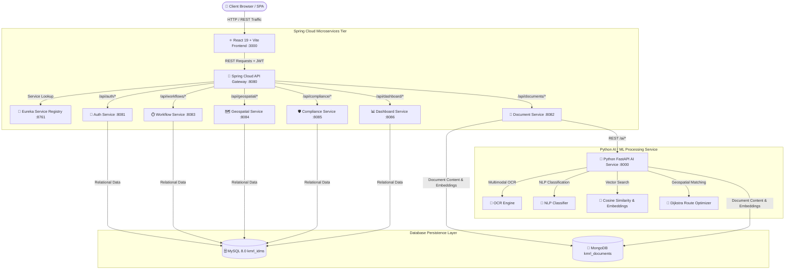

# 🚆 Kochi Metro Rail Limited (KMRL) — Intelligent Document Management System (IDMS)

[](https://www.oracle.com/java/)
[](https://spring.io/projects/spring-cloud)
[](https://react.dev/)
[](https://fastapi.tiangolo.com/)
[](https://www.mysql.com/)
[](https://www.mongodb.com/)

> **Project Perspective & System Architecture**: An enterprise-grade **Intelligent Document Management System (IDMS)** custom-architected for **Kochi Metro Rail Limited (KMRL)** operational, legal, structural, and compliance workflows. Features **React 19**, **Spring Cloud Microservices**, **Python FastAPI AI Processing**, **MySQL 8.0**, **MongoDB**, **Geospatial GIS Engine**, and **SLA-Driven Workflows**.

---

## 📚 Structured Documentation Index

All reference documentation is structured under the [docs](docs/) directory:

- 🏗️ [System Architecture Guide](docs/ARCHITECTURE.md) — Microservices topology, Spring Cloud Gateway, Eureka, and Python AI communication flow.
- 🔐 [Role-Based Access Control (RBAC) Matrix](docs/RBAC_MATRIX.md) — Permissions matrix for Admin, Manager, Compliance Officer, Dept Officer, and User roles with server-side JPA scoping logic.
- 🗄️ [Database Schema & Data Models](docs/DATABASE_SCHEMA.md) — Complete MySQL relational DDL schemas and MongoDB document collection specifications.
- 🐍 [Python FastAPI AI Microservice Guide](docs/AI_SERVICE_GUIDE.md) — OCR processing, NLP classification, spaCy entity parsing, 384/3072-dim embeddings, vector search security, and Dijkstra route optimization.
- 🧠 [AI/ML Engine & Model Specifications](docs/AI_MODEL_DOCUMENTATION.md) — Deep technical specification for Google Gemini & PyTesseract perception models and vector similarity pipelines.
- 🚀 [Setup & Execution Guide](docs/SETUP_RUN_GUIDE.md) — Step-by-step instructions for running the complete system via scripts, VS Code tasks, and verifying service health.
- 🔗 [ER Diagram](docs/KMRL_IDMS%20ER%20Diagram.jpeg) — Entity-Relationship diagram representing the relational database structure and relationships.
---

## 🏗️ System Topology Overview



---

## ✨ Key System Capabilities

- **Real Multimodal OCR & Vision**: Text extraction from PDFs, blueprints, PNG/JPEG images using PyTesseract & Gemini perception engines.
- **NLP Auto-Classification**: Dynamic document tagging across departments (`Civil Works`, `Operations & Safety`, `Finance & Legal`, `Signaling & Telecom`), file categories, sensitivity levels, and executive summary generation.
- **Dense Vector Embedding Search**: 384/3072-dimensional vector embeddings with Cosine Similarity, pre-filtered by the user's department authorization scope.
- **GIS Entity NER & Interactive Maps**: Parsing Kerala survey numbers (*Sur-210/4C*), revenue villages, and metro stations (*Aluva*, *Edapally*, *Muttom*, *Pettah*) rendered on interactive Leaflet maps.
- **Dijkstra Metro Route Optimizer**: Computes shortest station transit path, total travel distance in km, transit time, and hop counts across the KMRL metro network.
- **SLA-Driven Approval Workflows**: Multi-stage approval routing with dynamic SLA countdown timers, priority escalations, and approver sign-off logs.
- **Statutory Compliance & Security Audit**: Tracking CMRS safety certificates, KPCB environmental clearances, fire safety filings, and immutable security audit trails.

---

## 🛠️ Technology Stack

| Layer | Technology | Purpose |
| :--- | :--- | :--- |
| **Frontend** | React 19, Vite 6, Tailwind CSS 4, Lucide React | Modern SPA User Interface |
| **GIS & Analytics** | Leaflet 1.9, Recharts 2.12 | Interactive Map & Data Visualization |
| **Backend Core** | Java 17, Spring Boot 3.2, Spring Security | Microservices Core & BCrypt Security |
| **Service Mesh** | Spring Cloud Gateway, Netflix Eureka | API Proxy Routing & Service Discovery |
| **AI Microservice** | Python 3.10+, FastAPI, NumPy, PyTesseract | Multimodal OCR, NLP, Vectors & Dijkstra |
| **Databases** | MySQL 8.0, MongoDB 6.0+ | Polyglot Relational & Document Vector Store |

---

## 🔐 Role-Based Access Control (RBAC) Summary

| Portal Module | Admin | Manager | Compliance Officer | Dept Officer | User |
| :--- | :---: | :---: | :---: | :---: | :---: |
| **Dashboard Metrics** (`dashboard`) | ✅ | ✅ | ✅ | ✅ | ✅ |
| **Multimodal Document Upload & OCR** (`documents`) | ✅ | ✅ | ❌ | ✅ | ✅ |
| **Document Repository Access** (`my-documents`) | ✅ All | ✅ Own Dept. | ✅ Authorized | ✅ Own Dept. | ✅ Authorized |
| **3072-dim Semantic Vector Search** (`search`) | ✅ All | ✅ Own Dept. | ✅ Authorized | ✅ Own Dept. | ✅ Authorized |
| **GIS Map & Dijkstra Route Optimizer** (`geospatial`) | ✅ | ✅ | ✅ | ✅ | ✅ |
| **SLA Workflow Review & Approval** (`workflows`) | ✅ | ✅ | ❌ | ✅ Assigned | ❌ |
| **Compliance Management** (`compliance`) | ✅ | ❌ | ✅ | ❌ | ❌ |
| **Immutable System Audit Trail** (`audit`) | ✅ | ✅ | ✅ | ❌ | ❌ |
| **User & Account Management** (`admin-users`) | ✅ | ❌ | ❌ | ❌ | ❌ |
| **System Configuration** (`microservices`) | ✅ | ❌ | ❌ | ❌ | ❌ |

---

## 🚀 Quick Execution

Run the complete system using the master script:

```bash
chmod +x ./run-all.sh
./run-all.sh
```

Or view the [Setup & Run Guide](./docs/SETUP_RUN_GUIDE.md) for detailed VS Code task runner instructions.
---

## 🔗 Entity-Relationship Diagram

The ER diagram represents the entities, attributes, and relationships within the KMRL IDMS database.


---
