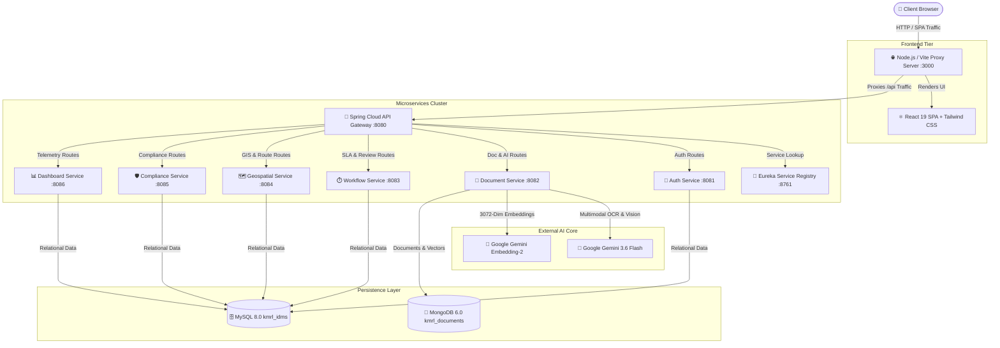

# 🚆 Kochi Metro Rail Limited (KMRL) — Intelligent Document Management System (IDMS)

[](https://www.oracle.com/java/)
[](https://spring.io/projects/spring-cloud)
[](https://react.dev/)
[](https://vitejs.dev/)
[](https://ai.google.dev/)
[](https://www.mysql.com/)
[](https://www.mongodb.com/)

> **Proof of Concept & Idea Perspective**: A conceptual prototype of an **Intelligent Document Management System (IDMS)** designed for **Kochi Metro Rail Limited (KMRL)** use cases. Demonstrates how **Spring Cloud Microservices**, **React 19**, **Google Gemini AI**, **Geospatial GIS Engine**, and **SLA Approval Workflows** can streamline rail infrastructure governance and document intelligence.

---

## 📋 Table of Contents

- [System Architecture](#-system-architecture)
- [Core Capabilities](#-core-capabilities)
- [Tech Stack Overview](#-tech-stack-overview)
- [Microservices Cluster & Ports](#-microservices-cluster--ports)
- [AI/ML Engine Specifications](#-aiml-engine-specifications)
- [Database Schema & Data Models](#-database-schema--data-models)
- [Quick Start & Local Setup](#-quick-start--local-setup)
- [Role-Based Access Control (RBAC)](#-role-based-access-control-rbac)
- [API Documentation](#-api-documentation)
- [Troubleshooting & FAQs](#-troubleshooting--faqs)

---

## 🏗️ System Architecture



---

## ✨ Core Capabilities

* **Multimodal OCR & Vision**: Instant verbatim text extraction from PDFs, blueprints, PNG/JPEG images using Google Gemini 3.6 Flash.
* **Auto-Classification**: Automated tagging of department (`Civil Works`, `Operations & Safety`, `Finance & Legal`, `Signaling & Telecom`), file category, sensitivity level, and NLP executive summary generation.
* **3072-Dimensional Vector Search**: Dense vector embeddings generated via `gemini-embedding-2` for natural language semantic concept retrieval using Cosine Similarity.
* **GIS Spatial Entity Extraction (NER)**: Parses Metro stations (*Aluva*, *Edapally*, *Muttom*, *Pettah*), survey numbers (*Sur-210/4C*), and revenue villages to plot locations on interactive Leaflet maps.
* **Dijkstra Route Optimizer**: Computes shortest station transit path, total distance in km, travel time, and hop count across the KMRL Blue Line Phase 1 network.
* **SLA-Driven Workflow Engine**: Multi-stage approval routing with dynamic SLA countdown timers, priority escalations, and digital sign-off logs.
* **Statutory Compliance & Security Audit**: Real-time tracking of CMRS safety clearances, KPCB environmental permits, fire safety filings, and immutable security audit logs.

---

## 🛠️ Tech Stack Overview

| Layer | Technology | Purpose |
| :--- | :--- | :--- |
| **Frontend** | React 19, Vite 6, Tailwind CSS 4, Framer Motion | Modern SPA User Interface |
| **GIS & Analytics** | Leaflet 1.9, Recharts 3.10, Lucide Icons | Interactive Map & Data Visualization |
| **Backend Core** | Java 17, Spring Boot 3.x | Enterprise Microservices Framework |
| **Service Mesh** | Spring Cloud Gateway, Netflix Eureka | Central API Routing & Service Discovery |
| **Databases** | MySQL 8.0, MongoDB 6.0 | Dual Relational & Document Vector Store |
| **AI/ML Engine** | Google Gemini SDK (`@google/genai` v2.4) | Multimodal OCR, NLP Classification & Embeddings |

---

## 🔀 Microservices Cluster & Ports

| Service Name | Port | Target Database | Operational Responsibility |
| :--- | :---: | :--- | :--- |
| **Service Registry (Eureka)** | `:8761` | N/A | Microservice instance registration & heartbeat dashboard |
| **API Gateway** | `:8080` | N/A | Central API proxy, CORS policy enforcement & JWT routing |
| **Auth Service** | `:8081` | MySQL (`kmrl_idms`) | BCrypt security, JWT issuance & user account RBAC management |
| **Document Service** | `:8082` | MongoDB (`kmrl_documents`) | OCR processing, NLP classification & 3072-dim vector embeddings |
| **Workflow Service** | `:8083` | MySQL (`kmrl_idms`) | SLA calculation, approval task assignment & deadline tracking |
| **Geospatial Service** | `:8084` | MySQL (`kmrl_idms`) | GIS station mapping, Kerala survey number NER & Dijkstra routing |
| **Compliance Service** | `:8085` | MySQL (`kmrl_idms`) | CMRS safety clearances, KPCB statutory audits & health scores |
| **Dashboard Service** | `:8086` | MySQL (`kmrl_idms`) | Aggregate system metrics & immutable security audit logging |
| **Web Application** | `:3000` | Local Proxy | React SPA Application & Express API proxy forwarder |

---

## 🤖 AI/ML Engine Specifications

### 1. Multimodal OCR Engine
* **Model**: Google Gemini 3.6 Flash (`gemini-3.6-flash`)
* **SDK**: `@google/genai` (v2.4.0)
* **Accepted Inputs**: PDF (`application/pdf`), PNG, JPEG, Plaintext.
* **Output**: Structured verbatim document text, survey plot tags, and table formatting.

### 2. NLP Document Classification & Summarization
* **Model**: Google Gemini 3.6 Flash (`gemini-3.6-flash`)
* **Output Schema**:
  ```json
  {
    "department": "Civil Works | Operations & Safety | Finance & Legal | Signaling & Telecom",
    "category": "Technical Specification | Safety Certificate | Financial Audit Report | Contract Agreement",
    "sensitivity": "Confidential | Restricted | Internal | Public",
    "confidenceScore": 0.984,
    "summary": "Executive summary of document contents..."
  }
  ```

### 3. Vector Embedding Semantic Search
* **Model**: Google Gemini Text Embedding v2 (`gemini-embedding-2`)
* **Embedding Vector**: **3072 float32 dimensions**
* **Distance Metric**: **Cosine Similarity** ($\cos(\theta) = \frac{\mathbf{A} \cdot \mathbf{B}}{\|\mathbf{A}\| \|\mathbf{B}\|}$)
* **Storage**: Embedded numerical float array inside MongoDB (`kmrl_documents.documents.embedding`).

### 4. Spatial Named Entity Recognition (NER)
* **Entities**: `stationName`, `surveyNo`, `village`, `district`, `parsedAddress`.
* **GIS Matcher**: Resolves `stationName` to MySQL `metro_location` records (`latitude`, `longitude`).

---

## 💾 Database Schema & Data Models

### MySQL Schema (`kmrl_idms`)
* `users`: Account IDs, BCrypt password hashes, email addresses, department names, active states.
* `roles`: Role definitions (`ADMIN`, `MANAGER`, `COMPLIANCE_OFFICER`, `DEPARTMENT_OFFICER`, `USER`).
* `workflows` & `approvals`: Multi-stage approval tasks, assigned officers, SLA hours, priority levels, sign-off logs.
* `compliance_records`: Statutory permits, CMRS certificates, expiry dates, compliance percentages.
* `audit_logs`: Time-stamped immutable operational security audit logs.
* `metro_location`: GIS coordinates for stations (*Aluva*, *Edapally*, *Muttom*, *Pettah*), survey plot references.

### MongoDB Document Schema (`kmrl_documents`)
* `documents`:
  ```json
  {
    "_id": "ObjectId(...)",
    "title": "Aluva Station Structural Assessment",
    "rawText": "FULL_EXTRACTED_OCR_TEXT_BUFFER...",
    "department": "Civil Works",
    "category": "Technical Specification",
    "sensitivity": "Confidential",
    "geminiSummary": "Structural audit report for Aluva station elevated corridor...",
    "embedding": [0.0124, -0.0451, 0.0892, "... 3072 float values ..."],
    "stationName": "Aluva Metro Station",
    "surveyNo": "Sur-210/4C",
    "village": "Aluva West",
    "district": "Ernakulam",
    "version": "v1.0",
    "createdAt": "2026-08-18T10:00:00Z"
  }
  ```

---

## 🚀 Quick Start & Local Setup

### 1. Prerequisites
- **Java 17 JDK** (`java -version`)
- **Apache Maven 3.8+** (`mvn -version`)
- **Node.js 18+ and npm** (`node -v`, `npm -v`)
- **MySQL 8.0+** running on `localhost:3306`
- **MongoDB 6.0+** running on `localhost:27017`
- **Google Gemini API Key** from [Google AI Studio](https://ai.google.dev/)

### 2. Database Initialization
```sql
-- MySQL: Connect to localhost:3306
CREATE DATABASE IF NOT EXISTS kmrl_idms CHARACTER SET utf8mb4 COLLATE utf8mb4_unicode_ci;
```
*(MongoDB database `kmrl_documents` initializes automatically on first document intake)*

### 3. Environment Variables
Create a `.env` file in the root directory:
```bash
export GEMINI_API_KEY="your_actual_gemini_api_key_here"
export MYSQL_HOST="localhost"
export MYSQL_PORT="3306"
export MYSQL_DATABASE="kmrl_idms"
export MYSQL_USERNAME="root"
export MYSQL_PASSWORD="your_password"
export MONGODB_URI="mongodb://localhost:27017/kmrl_documents"
```

### 4. Build & Launch Application

#### Build Backend:
```bash
mvn -f backend/pom.xml clean compile
```

#### Install & Start Web App:
```bash
npm install
npm run dev
```
*(Available at `http://localhost:3000`)*

#### Launch All Microservices (One-Click):
```bash
chmod +x start-services.sh
./start-services.sh
```

---

## 🔐 Role-Based Access Control (RBAC)

| Portal Module | Admin | Manager | Compliance Officer | Dept Officer | User |
| :--- | :---: | :---: | :---: | :---: | :---: |
| **Dashboard Metrics** | ✅ | ✅ | ✅ | ✅ | ✅ |
| **Multimodal Document Upload & OCR** | ✅ | ✅ | ❌ | ✅ | ❌ |
| **Document Repository Access** | ✅ | ✅ | ✅ | ✅ | ✅ |
| **3072-Dim Semantic Vector Search** | ✅ | ✅ | ✅ | ✅ | ✅ |
| **GIS Map & Dijkstra Route Optimizer** | ✅ | ✅ | ✅ | ✅ | ✅ |
| **SLA Workflow Review & Approval** | ✅ | ✅ | ❌ | ✅ | ❌ |
| **Compliance Management** | ✅ | ❌ | ✅ | ❌ | ❌ |
| **Immutable System Audit Trail** | ✅ | ✅ | ✅ | ❌ | ❌ |
| **User & Account Management** | ✅ | ❌ | ❌ | ❌ | ❌ |
| **System Configuration** | ✅ | ❌ | ❌ | ❌ | ❌ |

---

## 🌐 API Documentation

All REST API requests route through Spring Cloud API Gateway (`http://localhost:8080/api` or proxied via `http://localhost:3000/api`).

| Method | Endpoint | Target Service | Description |
| :---: | :--- | :--- | :--- |
| `POST` | `/api/auth/login` | Auth Service (:8081) | Authenticates user credentials & returns JWT |
| `GET` | `/api/auth/users` | Auth Service (:8081) | Retrieves all user accounts |
| `POST` | `/api/documents/upload` | Document Service (:8082) | Multimodal OCR intake, classification & embedding |
| `GET` | `/api/documents` | Document Service (:8082) | Fetches document repository records |
| `POST` | `/api/documents/semantic-search` | Document Service (:8082) | Performs 3072-dim Cosine vector search |
| `GET` | `/api/workflows` | Workflow Service (:8083) | Retrieves active SLA review tasks |
| `POST` | `/api/workflows/{id}/approve` | Workflow Service (:8083) | Records approval sign-off stage |
| `GET` | `/api/geospatial/locations` | Geospatial Service (:8084)| Returns GIS station location pins |
| `POST` | `/api/geospatial/route` | Geospatial Service (:8084)| Computes Dijkstra shortest corridor path |
| `GET` | `/api/compliance/records` | Compliance Service (:8085)| Retrieves statutory compliance files |
| `GET` | `/api/dashboard/metrics` | Dashboard Service (:8086) | Returns aggregate system statistics |
| `GET` | `/api/dashboard/audits` | Dashboard Service (:8086) | Fetches immutable security audit logs |

---

## ❓ Troubleshooting & FAQs

<details>
<summary><b>1. Error: "Java Spring Cloud Gateway (http://localhost:8080) unavailable"</b></summary>
<br/>
<b>Cause</b>: The API Gateway microservice is not active on port 8080.<br/>
<b>Resolution</b>: Launch `api-gateway` (`mvn -f backend/api-gateway spring-boot:run`) and verify Eureka at <code>http://localhost:8761</code>.
</details>

<details>
<summary><b>2. Semantic Vector Search returning 0 results</b></summary>
<br/>
<b>Cause</b>: `GEMINI_API_KEY` is missing or invalid.<br/>
<b>Resolution</b>: Export a valid key (`export GEMINI_API_KEY="your_key"`) before starting `document-service`.
</details>

<details>
<summary><b>3. Database connection failure</b></summary>
<br/>
<b>Cause</b>: Local MySQL or MongoDB services are stopped.<br/>
<b>Resolution</b>: Ensure MySQL (`localhost:3306`) and MongoDB (`localhost:27017`) daemons are active.
</details>

---

## 📌 Project Disclaimer & Perspective

This repository is an independent **Proof of Concept (PoC) and Idea Perspective** demonstrating an intelligent document management system architecture tailored for metro rail infrastructure management scenarios (using Kochi Metro Rail Limited as a reference use case). Powered by **Google Gemini AI**.


