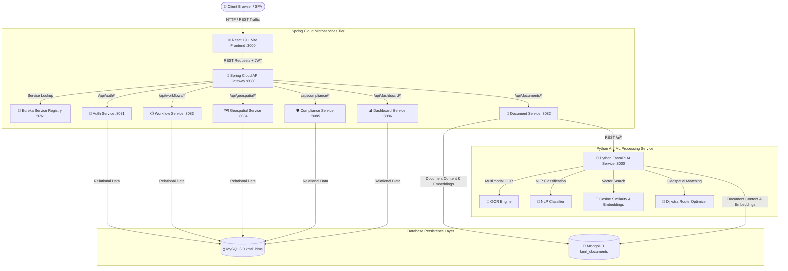

# 🏗️ KMRL-IDMS System Architecture & Microservices Topology

The **KMRL Intelligent Document Management System (KMRL-IDMS)** is built on a modern, decoupled microservices architecture designed for Kochi Metro Rail Limited operational workflows.

---

## 📐 High-Level Architecture Diagram

---

## 🔀 Microservice Components & Ports

| Service Name | Port | Database | Primary Responsibility |
| :--- | :---: | :--- | :--- |
| **Service Registry (Eureka)** | `:8761` | N/A | Central service discovery & health check dashboard |
| **API Gateway** | `:8080` | N/A | Single entry point, JWT validation, CORS enforcement & routing |
| **Auth Service** | `:8081` | MySQL (`kmrl_idms`) | BCrypt password hashing, JWT token issuance & user management |
| **Document Service** | `:8082` | MySQL & MongoDB | Document metadata, versioning, JPA department authorization & AI delegation |
| **Workflow Service** | `:8083` | MySQL (`kmrl_idms`) | SLA calculation, 3-stage approval routing & deadline tracking |
| **Geospatial Service** | `:8084` | MySQL (`kmrl_idms`) | GIS station mapping, Kerala survey number NER & route calculations |
| **Compliance Service** | `:8085` | MySQL (`kmrl_idms`) | Statutory CMRS safety clearances, KPCB filings & audit tracking |
| **Dashboard Service** | `:8086` | MySQL & MongoDB | Real-time KPI aggregation & immutable audit trail logging |
| **Python FastAPI AI Service** | `:8000` | MongoDB (`kmrl_documents`) | OCR extraction, NLP classification, vector search & Dijkstra routing |

---

## 🔗 Related Documentation
- 🏠 [Root README](../README.md)
- 🔐 [RBAC Matrix](RBAC_MATRIX.md)
- 🗄️ [Database Schema](DATABASE_SCHEMA.md)
- 🐍 [Python AI Service Guide](AI_SERVICE_GUIDE.md)
- 🧠 [AI Model Documentation](AI_MODEL_DOCUMENTATION.md)
- 🚀 [Setup & Run Guide](SETUP_RUN_GUIDE.md)
